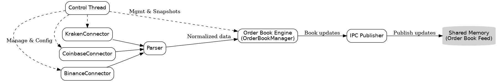
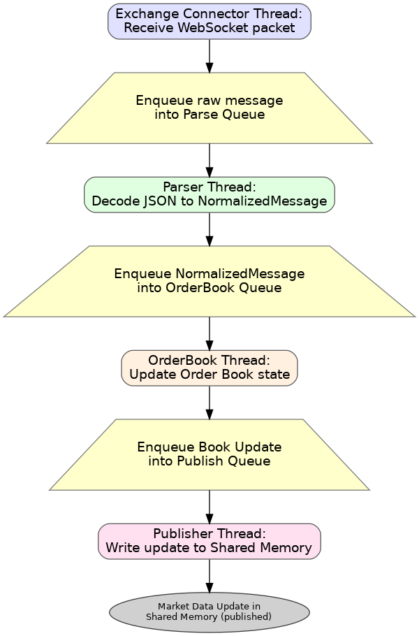

# High-Performance C++ Crypto Market Data Provider Architecture

## 1. High-Level Overview and Design Principles

This system is a **crypto market data provider** designed for **high performance and ultra-low latency** delivery of exchange order book data. Its purpose is to collect real-time market data (order book updates, trades, etc.) from multiple cryptocurrency exchanges and promptly distribute a normalized feed to local consumers (trading algorithms, analytics processes) via shared memory. The core architectural philosophy centers on minimizing latency at every step, enforcing a **single-responsibility design** for clarity and maintainability, and leveraging **cache-aware** optimizations in data structures.

**Low Latency Focus:** The data pipeline is kept as short and lock-free as possible, ensuring each update travels from the network to shared memory with minimal buffering or waiting. Where multi-threading is used, components communicate via lock-free queues to avoid blocking delays. Each stage processes data immediately upon arrival (no batching unless necessary), and threads may employ busy-wait spinning and CPU core affinity to reduce context-switch jitter (pinning critical threads to dedicated cores). This design echoes known feed handler pipelines in trading systems: *receive data → decode → update order state → update aggregated book → notify consumers* – all optimized for speed.

**Single-Responsibility & Modularity:** Each component in the system has a well-defined focus, following the single-responsibility principle (“a class should have only one reason to change”). This separation means Exchange Connector modules only handle connectivity and exchange-specific data retrieval, the Parser only handles message decoding, the Order Book Engine solely maintains order book state, etc. Such separation not only aids clarity but also localizes optimizations – each module can be tuned for its specific task without side-effects. It also aligns with clean design practice that avoids coupling different concerns in one module, enhancing robustness and maintainability.

**Cache-Aware Design:** The architecture and data structures are optimized for CPU cache efficiency to further reduce latency. For example, internal order book representations use contiguous memory layouts and fixed-size structures to minimize heap allocations and cache misses. Instead of pointer-heavy or tree-based structures, price levels and orders can be stored in arrays or contiguous buffers (e.g. sorted arrays for price levels) to leverage spatial locality, as this yields more consistent update times under high load. Lock-free ring buffers are used for inter-thread queues, implemented as circular arrays to avoid dynamic allocation and to let the compiler/hardware prefetch memory effectively. Overall, the system avoids unnecessary copies and intermediate data where possible, and makes trade-offs (like busy-wait polling on hot paths) to favor consistent low latency over CPU idling.

In summary, the provider is purpose-built to **ingest and normalize high-frequency market data with minimal delay**, using a modular pipeline where each component does one job extremely efficiently. Next, we detail these components and their interactions in the system’s architecture.

## 2. System Components and Interactions

**Figure 1: High-Level Component Architecture.** 

The market data provider consists of several key components running concurrently and interacting in a pipeline. 
**Exchange Connectors** (one per exchange, e.g. BinanceConnector, CoinbaseConnector, etc.) maintain live WebSocket connections to exchanges and receive raw market data feeds. Incoming exchange messages (typically JSON or proprietary formats) flow into the **Parser** component (one per exchange, running on its own thread), which translates raw updates into a unified **NormalizedMessage** format understood by the rest of the system. These normalized updates are then passed to the **Order Book Engine** (which contains an **OrderBookManager** managing order books for many trading pairs). The **Order Book Engine** updates the in-memory order book for the relevant instrument and produces consolidated updates (e.g. best bid/ask changes or full depth changes). Finally, an **IPC Publisher** component disseminates these updates to other processes by writing them into a **shared memory** region for consumers. A dedicated **Control Thread** oversees the system, handling configuration, startup/shutdown of components, and orchestration of snapshots or recovery logic. The diagram illustrates how data moves **one-way from exchanges to clients** through the pipeline (solid arrows), while the control thread sends control signals (dashed arrows) to manage the components.

Each component has a clear role and interacts with others via minimal, well-defined interfaces, reflecting the single-responsibility design mentioned earlier. For example, **Exchange Connectors** deal only with receiving data and pass it along – they do not parse or maintain state. The **Parser** does not know about networking or threading; it simply transforms message formats. The **Order Book Engine** is isolated from networking details – it consumes ready-to-use normalized messages and focuses on maintaining correct order book state and generating output events. This decoupling allows each part of the system to be optimized independently (for instance, the parsing logic can be tuned or replaced without affecting networking, and the order book data structure can be refined without changing how data arrives). It also aligns with known high-performance feed handler architectures, where the duties of data decoding, book assembly, and distribution are separated for efficiency.

Notably, **low-latency considerations** inform the interactions between components. Connectors push data to Parsers as soon as it arrives (possibly using in-process ring buffers), ensuring no blocking on network reads. The use of lock-free queues between Parser→OrderBook and OrderBook→Publisher means threads don’t stall each other – instead, each stage works in parallel on different CPU cores, communicating via non-blocking buffers. This design lets the pipeline handle hundreds of thousands of updates per second with minimal jitter, as each component does a small amount of work and hands off quickly to the next stage. The Order Book Engine, for example, can update an aggregate order book in microseconds by using efficient data structures (e.g. array-based price levels) that avoid expensive heap operations. After updating, it immediately enqueues an update for publishing rather than performing any I/O itself, keeping the hot path lightweight.

The **Control Thread** (or management module) shown in Figure 1 is the only part of the system that doesn’t participate in the per-update hot path. Instead, it interacts with all components to manage the overall process: it loads configuration (which exchanges/symbols to connect, thread affinities, etc.), starts and stops connectors, triggers snapshot retrieval procedures, and monitors health. For instance, on startup the control thread instructs each Exchange Connector to connect and subscribe to the desired market data channels. It may also tell each connector when to fetch an initial snapshot (or call a Snapshot module) before allowing the live feed to be processed. If an exchange connection drops or lags, the control thread can restart that connector. These management commands are depicted as dashed arrows in the diagram (e.g. “Manage & Config” signals to connectors, and “Mgmt & Snapshots” to the Order Book Engine for initiating snapshot integration). This separation ensures that **non-latency-critical tasks** (configuration changes, logging, etc.) are handled outside the real-time data threads, preserving consistent performance for the hot path.

## 2.1 Thread model

1. **Exchange Connector Threads**
   - One per exchange (e.g. `BinanceConnector`, `CoinbaseConnector`), runs on dedicated core.
   - Maintains persistent WebSocket connection to venue.
   - Handles authentication, heartbeats, and raw frame reception.
   - Pushes raw messages into a lock-free **SPSC** queue to its Parser thread.

2. **Parser Threads**
   - One per exchange, runs on dedicated core.
   - Decodes venue-specific raw format (JSON/binary) into unified `NormalizedMessage`.
   - No networking or order book logic; purely format translation.
   - Publishes normalized updates into a lock-free queue to the Order Book Engine.

3. **Order Book Engine Threads**
   - One or more worker threads, sharded by instrument/symbol group.
   - Owns `OrderBookManager` and per-symbol `OrderBook` instances.
   - Applies deltas/snapshots to in-memory books with sequence checks.
   - Generates output events (e.g. top-of-book, depth changes) for IPC Publisher.

4. **IPC Publisher Thread**
   - Single dedicated publisher.
   - Reads book events from **MPSC** queue.
   - Serializes and writes them into shared memory ring/journal for consumer processes.

5. **Control/Management Thread**
   - Not on hot path.
   - Loads configuration, sets thread affinities, starts/stops components.
   - Orchestrates initial snapshot retrieval and resync after gaps/reconnects.
   - Monitors health and handles management commands.

## 3. Latency-Critical Hot Path Flow

**Figure 2: Latency-Critical Hot Path from Ingestion to Publication.** This flowchart details the sequence of steps and thread hand-offs that occur for each market data update, from the moment a raw WebSocket message arrives to the moment the normalized update is published in shared memory. Each stage is labeled with the responsible thread, and the yellow parallelogram steps indicate **lock-free queue transitions** between threads. The design ensures that each hand-off is non-blocking and minimal, so the data spends almost no time waiting in queues.

1. **Exchange Connector Thread Receives Data:** A WebSocket packet (e.g. an order book delta from Binance) arrives from the network. The **ExchangeConnector** thread dedicated to that connection immediately reads the packet from the socket. This is a raw message (often JSON text or binary format) containing the exchange’s update. The connector performs lightweight preprocessing (e.g. framing, basic validation) then **enqueues the raw message into an in-memory parse queue** shared with the **Parser** stage. This enqueue operation is lock-free (using atomic ring buffer indices) so it completes in a few CPU instructions. The connector thread can then loop back to reading the next network packet without delay.

2. **Parser Thread Decodes Message:** The Parser thread (running in parallel on another core) continuously polls the parse queue for new messages. When the raw message is available, the Parser thread dequeues it and **parses the exchange-specific format into a NormalizedMessage object**. For example, it will decode the JSON string into a structured update (fields like symbol, side, price, quantity, etc., in a unified format). This stage is optimized to avoid memory allocations – e.g. using a pre-allocated buffer or streaming parser to extract values without creating temporary objects, which is crucial for predictable low latency. The result is a compact NormalizedMessage representing the update. Once ready, the Parser thread **enqueues the NormalizedMessage into the OrderBook queue** for the Order Book Engine. Again, this uses a lock-free ring buffer structure so that the OrderBook thread can later retrieve it without contention.

3. **Order Book Engine Updates State:** The OrderBook thread waits on the OrderBook queue and, upon receiving a new NormalizedMessage, it processes the update. This involves finding the correct OrderBook (by instrument and market) and applying the delta: e.g. adding, modifying, or removing an order or price level, or updating trade volume. The **Order Book Engine** is highly optimized – it uses data structures engineered for fast updates and iterations. For instance, price levels might be stored in sorted arrays to allow in-place updates with minimal memory churn, which significantly reduces cache misses and latency jitter. Because the heavy parsing was done earlier, the OrderBook thread deals with numeric values and IDs in a format it can directly use (no string processing here). It updates internal maps (like order ID → order details) and updates the aggregated book (bid/ask heaps or arrays). The complexity of an update is kept low (often O(log n) or O(n) on small n, where n is number of price levels), and **no locks** are needed since each book is updated by a single thread. After updating the book, the OrderBook thread creates an output event – for example, the new best bid/ask or a snapshot of changed levels – and **enqueues this update into the Publish queue** for the IPC Publisher. This queue is also lock-free and allows the OrderBook thread to immediately continue processing the next message (if any) without waiting for slow I/O.

4. **IPC Publisher Writes to Shared Memory:** The Publisher thread, running concurrently, monitors the publish queue for new output events. When an update event is available, the Publisher thread dequeues it and **writes the update into the shared memory segment**, making it available to consuming processes. The shared memory is structured as a high-throughput IPC channel – for example, a ring buffer in shared memory or a sequence of memory-mapped records. Writing to it typically involves copying the update data (already in binary form) into the shared memory buffer at the next write position, and updating an atomic pointer or sequence number. This design ensures consumers can read a continuous stream of updates with minimal overhead (just reading from memory). Because the Publisher thread is the sole writer, and consumers are readers, synchronization can be achieved with simple atomic flags or sequence counters (readers can detect new data by a sequence number change). The use of a ring buffer in shared memory means that if a consumer is momentarily slower, it can read multiple queued updates in one go to catch up, ensuring no data is lost. Once the write is complete, the new market data update is officially “published” and visible to any process attached to the shared memory. This completes the hot path for one message: from network to shared memory in a few hops, all of which are non-blocking and optimized for speed.

**Threading & Queues:** As highlighted, each transition between threads uses a **lock-free ring buffer** queue. This avoids context-switching delays caused by mutexes, allowing threads to exchange data with **minimal latency overhead**. Each thread can run on a dedicated core; in high-throughput scenarios, threads might employ busy-wait polling on their queues (spinning in user-space) rather than sleeping, to achieve sub-microsecond wake-ups. The cost is higher CPU usage, but it prevents the OS scheduler from interrupting the pipeline, which is a common technique in low-latency systems. Because the pipeline is sequential, the overall latency is roughly the sum of the work at each stage (a few microseconds each), plus a few nanoseconds for each atomic queue operation – easily in the tens of microseconds end-to-end, depending on update size and hardware.

Importantly, the system is designed to handle bursts of messages. If bursts occur, each stage’s queue will buffer messages briefly. The queues act as shock absorbers to decouple producer and consumer speeds. For example, if a parsing thread momentarily falls behind, incoming data will accumulate in the parse queue; the Exchange Connector can keep receiving without dropping packets (up to the queue capacity). The lock-free queues are sized to accommodate typical bursts. Consumers (downstream threads) always **process all available messages** before idling, so they catch up when the burst subsides. This way, no updates are lost and latency remains as low as possible given the real-time load.

In summary, the hot path is a carefully constructed pipeline where **each thread does a small amount of work then hands off** to the next via a fast, non-blocking queue. This maximizes parallelism and throughput while keeping per-message latency very low and predictable. Performance measurements in similar systems show that such pipelines can process hundreds of thousands of messages per second with sub-millisecond end-to-end latency, thanks to avoiding unnecessary waits and leveraging CPU cache efficiency for data handling.

## 4. Key Modules and Classes

The system’s codebase is organized into modules and classes corresponding to the components above. Below is a breakdown of the **key classes/modules** and their roles and interactions:

* **`ExchangeConnector` (abstract class):** Defines a generic interface for an exchange connection. It manages the WebSocket (or other API) connection to a crypto exchange and handles subscription to relevant market data streams. Responsibilities include connecting/reconnecting, listening for incoming messages, and pushing raw data into the Parser or pipeline. Each connector runs in its own thread context. It exposes events (or uses a callback/queue) for incoming messages. The design expects one `ExchangeConnector` per exchange (or even per exchange instance/market), following SRP by encapsulating all exchange-specific logic here. It collaborates with the Parser (by forwarding raw messages to be parsed) and the ControlThread (which can instruct it to start/stop or fetch snapshots).

* **`BinanceConnector`, `CoinbaseConnector`, etc. (concrete connectors):** These are subclasses of ExchangeConnector implementing exchange-specific details (e.g. URL endpoints, authentication if needed, message format specifics). For instance, `BinanceConnector` knows the Binance WebSocket endpoints and message schemas. It might handle Binance-specific pings or subscription topics. When a message arrives, it may do minimal processing (e.g. uncompress if compressed, combine partial packets, etc.) and then invokes the Parser or directly produces a message for the Parser. These connectors may also implement a method to **fetch initial snapshots** via REST HTTP calls (since Binance, etc., require a REST depth snapshot) – the Control thread can call `connector.fetchSnapshot(symbol)` as part of startup. Each connector uses the NormalizedMessage format to output data (it might construct a preliminary NormalizedMessage or a raw JSON handed to Parser depending on design).

* **`Parser` (module/class):** Responsible for translating raw exchange messages into the **NormalizedMessage** structure. In some designs, parsing might be done inside the connector thread itself; however, here it is conceptually a separate stage (and possibly a separate thread for heavier JSON processing). The Parser understands each exchange’s message format (JSON fields, binary protocols, etc.) and performs allocation-free parsing when possible. For example, it will parse Binance JSON updates by extracting fields like `price` and `quantity` without creating intermediate strings (using techniques such as streaming parsing or even SIMD JSON libraries for speed). The output is a populated NormalizedMessage. The Parser ensures that regardless of exchange differences (e.g. some exchanges send updates as deltas, others as snapshots), the resulting NormalizedMessage has a consistent schema. After parsing, it hands off the NormalizedMessage to the OrderBook engine via the queue. In summary, this module isolates all data format heterogeneity and produces clean, consumable update objects.

* **`NormalizedMessage` (struct/data class):** A lightweight data structure that holds a normalized market data update. It typically contains fields such as: `exchange_id` or enum (to know source exchange), `symbol` or instrument identifier, update type (e.g. snapshot, delta update, trade), and data details like price levels or trades. For order book deltas, it might contain arrays of changed bids and asks with their prices and quantities, along with sequence numbers or timestamps. This is the **common format** that the OrderBook Engine expects, decoupling the upstream format from internal processing. By making this a simple struct (possibly Plain-Old-Data), the system can copy and pass these messages efficiently (potentially even in shared memory between threads as needed, since it’s trivially copyable). This normalization step is crucial for supporting multiple exchanges – it gives the rest of the system a uniform view of market events.

* **`OrderBook` (class):** Represents the full order book for a single trading pair (instrument). It maintains the current state of all active buy orders (bids) and sell orders (asks) at various price levels. Internally, it may use two containers for bids and asks – often implemented as **sorted arrays or trees** of price levels. Given the performance focus, this class uses cache-friendly structures: e.g. a vector of price levels sorted best-to-worst price, which allows binary search and direct index access. Each price level entry might contain the price and aggregate size, and potentially a list of individual orders (or just the aggregate in a feed context). The OrderBook class provides methods to apply a NormalizedMessage update: e.g. **`applyUpdate(NormalizedMessage msg)`**, which will insert, modify, or delete orders/levels as instructed by the message (for example, if the message says “price X bid size is now Y”, the OrderBook will update that level to quantity Y, or remove it if Y=0). It also handles snapshot application – setting up the initial state from a full snapshot message. The goal is to perform updates in O(log n) or better, and without excessive memory churn. This class is used by OrderBookManager to maintain per-symbol books.

* **`OrderBookManager` (or **Order Book Engine** module):** Coordinates all the OrderBook instances and the incoming data stream. It runs in the OrderBook thread. The Manager holds a mapping from symbol -> OrderBook object. When it receives a NormalizedMessage from the Parser (via the queue), it routes it to the correct OrderBook (by symbol). It then invokes the OrderBook’s update methods to apply the change. If the update is an incremental delta, the manager ensures sequence continuity (using sequence numbers in the NormalizedMessage if provided – it will drop or request snapshot if out-of-order updates are detected as per exchange requirements). For a snapshot message, it will load the OrderBook from scratch. The OrderBookManager is also responsible for generating output events for publishing. After an OrderBook is updated, the manager can create a summary of changes or compute the new top-of-book to send out. For efficiency, this might be just the changed portions (e.g. a single price level update). The manager then pushes these updates to the IPC Publisher queue. **Interaction:** OrderBookManager interacts upstream with Parser (consuming messages) and downstream with IPC Publisher. It also interacts with ControlThread for special commands – e.g. if ControlThread requests a full snapshot refresh for a symbol, the manager may pause processing for that symbol and replace its OrderBook with a new snapshot state.

* **`IPCPublisher` (class/module):** Handles **Inter-Process Communication** for output. It is in charge of the shared memory region that acts as the distribution channel for market data updates. On startup, IPCPublisher creates or opens a shared memory segment (e.g. using `shm_open` or SysV SHM) of a configured size. It sets up a ring buffer or circular log structure in that memory. The Publisher thread then waits for new update events from the OrderBookManager (via the publish queue). When an update arrives, IPCPublisher serializes it into a compact binary form (if it’s not already a binary struct) and writes it into the next slot in the shared memory ring. This might involve copying a NormalizedMessage’s fields into a struct that is laid out in shared memory. Because multiple consumer processes may be reading, the publisher likely uses a write index that it updates atomically only after the write is complete (to avoid readers seeing a half-written entry). It may also set an *event* or flag to notify consumers (for example, updating a sequence number or sending a UNIX signal, though often consumers just poll or block on new data). The IPCPublisher abstracts all this so that the rest of the system just sees a “publish” action. Its key focus is **low-latency, lock-free writing** to the shared memory. No locks are needed because only one writer (publisher) exists; readers either use lock-free reads or a double-buffer approach. This component ensures that distribution to clients is as fast as internal processing – writing to RAM is extremely quick (microseconds). It interacts with OrderBookManager (input) and the operating system’s shared memory interface (output). Configuration may specify the memory key/name and size, which the ControlThread provides.

* **`ControlThread` (management/orchestration class):** Oversees the entire system’s operation. This is essentially the **main thread** that initializes all components, and then manages runtime events. At startup, ControlThread loads configuration (e.g. from a JSON/YAML file or arguments) that lists which exchanges and symbols to subscribe to, as well as parameters like queue sizes, thread pinning, etc. It then creates an ExchangeConnector for each exchange, assigns threads (often spawning a new thread to run the connector’s event loop), and establishes the Parser and OrderBook threads. It might create the Parser and OrderBook as separate thread objects, or in some implementations, those could run in the same thread as connectors – but here we assume separate threads for clarity. ControlThread then triggers **snapshot fetching**: for each exchange and symbol, either instruct the ExchangeConnector to perform a REST API call or invoke a dedicated Snapshot fetch routine. It supplies the resulting snapshot data to the OrderBookManager (e.g. via a special message or direct method) so that each OrderBook is primed with an initial state *before* live updates are processed. During operation, the ControlThread monitors each component (via heartbeats or simply catching thread exceptions). If a connector disconnects, ControlThread can restart it. It can also handle configuration updates or management commands – for instance, an admin could request to add a new symbol subscription at runtime; the ControlThread would then create a new OrderBook for that symbol and instruct the appropriate ExchangeConnector to subscribe to that symbol’s feed. Similarly, if an inconsistency is detected (e.g. an exchange data gap), the ControlThread can orchestrate a recovery: pausing processing for that symbol, fetching a fresh snapshot, and resuming the stream. This thread also gathers metrics/logs (latencies, queue depths) for monitoring. Essentially, ControlThread is the “brain” coordinating the other modules, without directly processing market data itself. It ensures the system remains **robust and in sync** with the exchanges and responds to external inputs.

These classes work together closely: ExchangeConnectors and Parser feed into OrderBookManager, which in turn feeds IPCPublisher. The control/orchestration code ties it all together, making sure each part starts in the right order and continues running. By organizing code into these focused classes, the system achieves a modular structure that is easier to reason about and optimize. For example, one can modify how the shared memory publishing works (say, switch to a different IPC mechanism) by editing IPCPublisher alone, since other components just push data to it through a queue. Similarly, new exchanges can be added by subclassing ExchangeConnector without altering the core engine. Each component can be unit-tested in isolation (e.g. feed mock data into Parser and verify NormalizedMessages, or test OrderBook’s update logic with sample inputs). This modular breakdown also reflects a separation of concerns aligned with the architecture diagram above.

## 5. Full System Workflow: Management, Configuration, and Snapshot Flows

Finally, we describe the **full system interaction** from startup to steady-state operation, including how configuration and snapshots are handled, and how management tasks occur:

1. **Initialization & Configuration:** On application start, the system loads configuration parameters (e.g. from a config file or environment). This includes the list of exchanges to connect (e.g. Binance, Coinbase) and which market symbols (trading pairs) to subscribe for each. It may also include API keys, endpoints, and performance tuning parameters (queue sizes, thread affinities, logging settings). The ControlThread then initializes components in sequence: it creates the shared memory segment for publishing (through IPCPublisher) and sets up the OrderBookManager with empty order books for each requested symbol. Next, it instantiates an ExchangeConnector for each target exchange, providing necessary config (like auth credentials or symbol lists). Each ExchangeConnector is started (on its own thread) and attempts to connect to the exchange’s market data WebSocket. The connectors send subscription requests for the configured symbols (e.g. subscribe to BTC/USD order book channel). At this point, the live data streams are *not yet fully trusted* until order book snapshots are synced – the system will buffer incoming updates but not apply them until a snapshot is in place.

2. **Initial Snapshot Fetch:** Because most crypto exchanges provide incremental updates that require a starting snapshot for accuracy, the system performs a **snapshot retrieval flow** for each symbol during startup (and any time re-sync is needed). Using the exchange’s REST API (or dedicated snapshot endpoint), the ControlThread or ExchangeConnector fetches a full **order book snapshot** (depth of book) for the symbol. For example, for Binance, this means an HTTP GET to a URL like `/api/v1/depth?symbol=XYZ&limit=1000` to get the top 1000 levels of the order book. The raw snapshot data is then parsed (either by the same Parser or a simpler JSON parse since it's one-time) into the NormalizedMessage format representing a full depth snapshot. The OrderBookManager receives this snapshot message and uses it to **initialize the OrderBook state** for that symbol (essentially seeding the internal OrderBook with all current bids and asks). While this happens, the Connector may have been buffering any real-time updates coming in on the WebSocket. Once the snapshot is applied, the system now has a baseline synchronized with the exchange at a known update ID. At this point, the buffered live updates are processed: the OrderBookManager will start applying the queued deltas *after* the snapshot’s lastUpdateId. Per Binance’s instructions, any delta with an update ID less than the snapshot’s ID is discarded (since it was already reflected in the snapshot), and processing begins from the first delta that overlaps or comes after the snapshot. This ensures no update is applied twice or out-of-order. The first processed update’s `U` and `u` (exchange sequence numbers) are checked to confirm it connects properly to the snapshot’s ID. After this synchronization, the live stream is considered in sync and the OrderBook updates proceed normally. The same pattern is repeated for each symbol and each exchange feed.

3. **Real-Time Streaming Operation:** With initial snapshots in place, the system enters steady state. ExchangeConnector threads continuously receive new market data updates from exchanges and feed them through the pipeline (Parser → OrderBook → Publisher) as described in section 3. The OrderBookManager updates each book and the IPCPublisher publishes updates to shared memory in real-time. Consumers attached to the shared memory can now see a stream of updates reflecting the live market. If a consumer needs a starting point, the system could either have published an initial full snapshot to shared memory at the start or the consumer might construct it by reading the latest state from the OrderBook (the design can be extended to allow a on-demand snapshot query to the provider if needed). The shared memory feed typically contains enough information for consumers to maintain their own copy of the order book if desired (e.g. by processing the same deltas). Throughout operation, the pipeline strives to maintain low latency – e.g. parse and processing times are consistently low, and any hiccup on an exchange connection is handled swiftly. The ControlThread monitors performance metrics: it may log if queues are filling (indicating a bottleneck), or if any thread is lagging behind. Under normal conditions, the system can run indefinitely, handling the continuous flow of updates from all configured markets and pushing them to clients.

4. **Recovery & Re-synchronization:** In practice, scenarios like network glitches or high load can cause sequence gaps or out-of-sync conditions. The architecture includes flows to handle these gracefully. **Sequence Gap Detection:** The OrderBookManager tracks sequence numbers (if provided by the exchange) for each symbol’s updates. If it notices a discontinuity – e.g. the next delta’s starting ID doesn’t match the expected value (meaning some updates were missed) – it will trigger a re-sync procedure. Similarly, if the WebSocket reconnects after a drop, a fresh snapshot is needed. In such cases, the ControlThread (or the affected ExchangeConnector) **pauses processing** of that symbol’s stream, discards or buffers incoming deltas, and initiates a **snapshot refresh** flow: fetch a new snapshot via REST, reset the OrderBook to that snapshot, then apply buffered deltas after the new snapshot’s point. This follows the same steps as the initial sync. For example, Binance’s guide indicates if the gap is detected (the `pu` in a delta is not equal to last processed `u`), you should reinitialize from a new snapshot. The system automates this: the ControlThread may call a function to refresh a given symbol’s book. During this, it might also alert any consumers (e.g. via a status flag in shared memory) that a resync occurred (so they might also choose to refetch state, depending on use case). **Fault Tolerance:** If an ExchangeConnector thread fails or disconnects, ControlThread restarts it and again performs snapshot sync. The modular design means one exchange going down doesn’t halt others – each connector is independent. Similarly, if the Parser thread or any processing thread crashes (e.g. due to unexpected data), the system can log the error and potentially restart that component. Robust error handling ensures the provider can recover from common failure modes without manual intervention.

5. **Management & Monitoring:** Outside the core data flow, the ControlThread also handles management tasks. **Configuration Management:** If the system supports dynamic config (not strictly required), the control could add or remove symbols or exchanges at runtime. For example, if a new trading pair becomes interesting, an operator could instruct the provider (via a command-line or API) to start tracking it. The ControlThread would then create a new OrderBook for it and instruct the corresponding ExchangeConnector to subscribe to that feed, followed by snapshot sync – all while other streams continue unaffected. **Resource Monitoring:** The control module keeps an eye on resource usage – it may periodically log how many messages per second are processed, queue lengths, latency statistics, etc., to ensure performance targets are met. In a high-performance setting, it’s common to measure end-to-end latency (timestamp at receive vs publish) for sample messages. If latency starts rising or a queue backup is detected, that might indicate the need for more CPU or other tuning. **Shutdown** is also coordinated by ControlThread: on shutdown command, it can signal all threads to finish gracefully (e.g. unsubscribe from feeds, flush queues, unmap shared memory). It ensures that consumers are informed or at least not left with partial data (for instance, it might write an end-of-stream marker in shared memory).

Throughout these interactions, the guiding principle is that the system **maintains accurate and timely order book data** for each subscribed market and makes it available to clients in real-time. The combination of initial snapshots and incremental updates keeps the local order books in sync with the exchanges. By managing snapshots and sequence continuity, the provider guarantees correctness (no matter if an exchange update was missed, the system will self-correct by refreshing state). By using configuration-driven setup and a control/orchestration layer, it’s easy to extend or adjust the system (add new exchanges, adjust what data is captured, tune performance settings) without touching the core pipeline logic.

**Consumers of the Data:** Although not part of the provider itself, it’s worth noting how clients interact with the shared memory feed. Consumer processes (which could be co-located trading algorithms written in C++, Python, etc.) would open the same shared memory segment (read-only) and read the market data updates in a loop. Thanks to the ring buffer design, a consumer that falls behind can read multiple pending updates quickly. Typically, a consumer will also reconstruct its own view of the order book by applying updates in the same way (or the provider might periodically publish full snapshots into the feed for convenience). Since the data is normalized, consumers don’t need to worry about exchange-specific differences – they get a unified stream of order book events. The low-latency nature of the feed (memory copy is the only delay added in distribution) means even high-frequency trading algorithms can rely on this data source without significant disadvantage compared to a direct exchange connection. In essence, the provider acts as a local hub that **fans out real-time market data** to any subscribed internal system, with the performance and design discipline necessary for high-frequency trading environments.

In conclusion, this architectural mapping has outlined a lean yet complete design of a C++ crypto market data provider. We’ve covered the high-level goals (ultra-low latency, single-purpose components, cache-optimized design), depicted the major components and their interactions, traced the critical real-time data flow through multi-threaded stages, broken down the key classes and their responsibilities, and described the full lifecycle of the system including configuration and snapshot synchronization. This design embodies clarity and performance-awareness: each piece is optimized for its role, and together they ensure that from the moment an exchange broadcasts an update to the moment our clients receive it in shared memory, only a tiny fraction of a second has passed, and the data integrity is preserved. Such an architecture is crucial for trading systems that depend on speed and accuracy of market data, and it provides a solid foundation that developers and reviewers can readily understand, maintain, and enhance as needed.